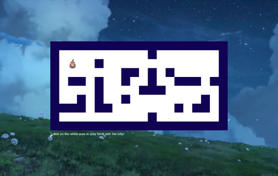

# Whisker Path 🐱

An interactive pathfinding visualizer where a cat navigates a maze to reach a fish using a greedy best-first search algorithm. Click anywhere on the grid to set a destination and watch the cat find its way!

  

## How It Works

Click any tile on the grid and the algorithm kicks in — it calculates the shortest path to your chosen tile using a greedy best-first search, visualizing every node it explores along the way. Once the path is found, the cat walks it step by step and does a happy dance when it reaches the fish.

## Features

- Greedy best-first search pathfinding visualization
- Animated pixel cat sprite with directional walk cycles (idle, walk, happy)
- Custom pixel art sprite sheet with 24 frames across 8 directions
- Fish reward animation with a toss effect
- Looping video background
- Fully responsive — scales to any screen size
- Wall tiles and maze layout built in

## Sprite Sheet

The cat sprite is a custom pixel art sheet with:
- 4 columns × 8 rows of animation frames
- Directional movement: down, up, left, right
- Happy/idle animation states
- Rendered with `image-rendering: pixelated` for crisp pixel art scaling

## Tech Stack

- Vanilla HTML, CSS, JavaScript
- No frameworks, no dependencies
- Deployed on Vercel

## Live Demo

[whisker-path.vercel.app](https://whisker-path.vercel.app)
